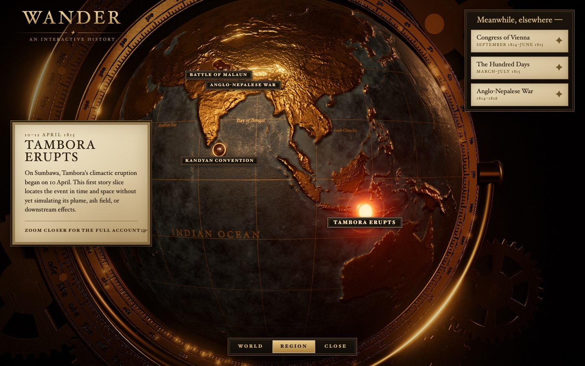

# Wander

Explore history on a 3D globe built like a brass museum orrery. Follow guided stories through
eruptions, voyages, plagues, and booms; scrub through time and zoom from the whole world down to a
single island.

Coming to [wander.traviscole.xyz](https://wander.traviscole.xyz).

## Status

In design. See [the product requirements](docs/PRD.md) and
[the asset streaming design](docs/design/streaming.md).

## License

Code is MIT-licensed (see `LICENSE`). Data comes from Natural Earth, GEBCO, ModE-RA, RESOLVE,
USGS, GMBA, historical-basemaps, and Wikidata under their own terms; attributions ship in the app's
Credits panel. Border geometry derived from historical-basemaps is GPL-3.0.
